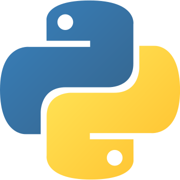

# Ben Morris, '24, B.S. Engineering/CS

I am a Computing major at Olin College of Engineering with a specialty in writing software to enable robots to make
decisions.

## I get the complicated problems

In the summer of 2022, I developed a novel path planning algorithm for [the Hummingbird project](hummingbird.md), a new research
project in Olin College's RoboLab.

## I understand the full cycle: from use to design to implementation

I [ran a project](easel.md) to identify and address workflow problems for professors' use of Canvas, a Learning
Management Software by identifying and addressing workflow problems.

## I thrive in environments in which people of different skills work towards a common goal

For my Collaborative Design class, I worked with a group of other engineers to design a product to improve the lives of
service animal trainers; our solution was [SAFEcert](safecert.md).

## I am more than just a programmer

Not only have I gotten the chance to take classes like Acting Shakespeare and [Tell the Story of What you Make](tell_the_story.md),
but I am the president of my college's theater group, the [Franklin W. Olin Players](fwop.md), where I got the chance to
act, but also stage-manage and even direct! 

## Languages and Tools

|    Python |    Java        |    C/C++                   |    Swift |
|:---:|:---:|:---:|:---:|
|        **OCaml**     |    **MATLAB** |    **JavaScript** |    **SQL** |
|     **Git/GitHub**  |    **Ubuntu** |    **ARKit** |    **Flask** |

## See my projects!

|    [Easel](easel.md) |    [Hummingbird](hummingbird.md) |    [Franklin W. Olin Players](fwop.md) |
|:---:|:---:|:---:|
|    [**Tell the Story**](tell_the_story.md) |    [**Invisible Map**](occam.md) |     [**SAFEcert**](safecert.md) |
|    [**Automatic Chess Board**](chess.md) |    [**Why is SAT NP-Complete?**](sat.md) |      [**Arcade Games**](arcade.md) |
|    [**Neato Tag**](neato_tag.md) |    [**Autonomous Rover**](funrobo.md) |    [**Noodle Maps**](noodlemaps.md) |
