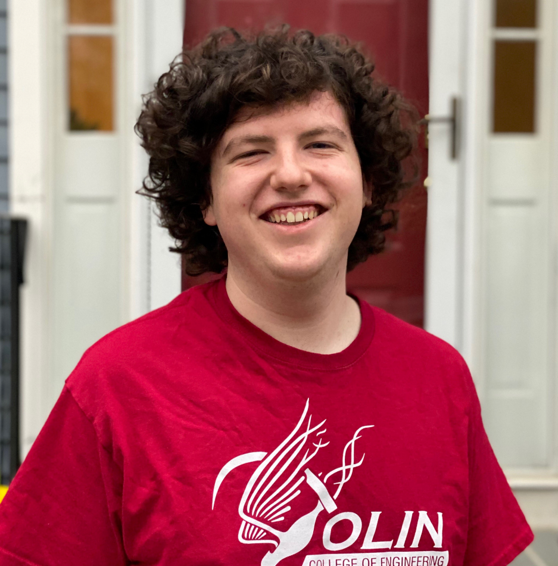
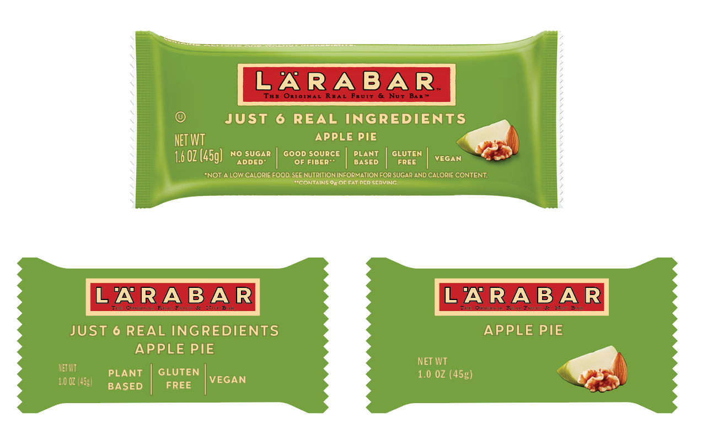
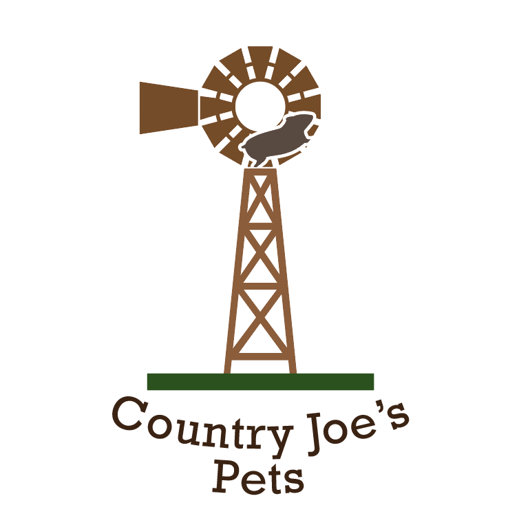
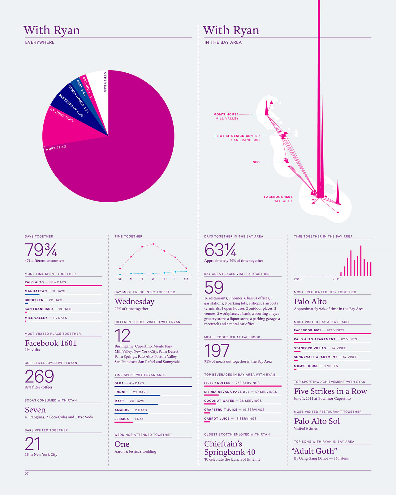

# Tell the Story of What You Make

Tell the Story of What You Make is a design class at Olin College taught by professor Tim Sauder, which I took in during my fall semester of Junior year. The class focuses on using design to be able to communicate different ideas. Through the class, I learned the basics of how to be a deliberate designer, how to give and receive good criticism, and got to work on a wide variety of different design projects! On this page, I will highlight the major projects that I am most proud of through my work in this class.

## Text Portrait

One of the first assignments was to make a self-portrait using only text and only a single font. The goal was to get us to start seeing text as shapes as well. I decided to use a very curly, handwritten font so I could better match my hair, and give myself a challenge for the rest of my face. Below is the image my portrait is based on, along with the final version of my text portrait.

 

## Miniaturizing Bars

Another exploratory project we did was to create packaging for a miniature version of a bar. I identified all the design elements on the original bar, and chose three of them to go on the miniaturized bar. I decided to go with two different versions. Below, you can see the original (large) bar design, along with two options for smaller versions that I designed.

## Punny Logo

For our final exploratory project, we had to make a logo for a made-up pet store named "Country Joe's Pets", and ideally have the logo be a pun of some kind. After taking a trip to the grocery store for inspiration on pun-based logos, I developped this:

## Infographic

In the next stage of the class, we were looking to make work that mimics the style of other graphic designers. One of the works I mimicked was that of Feltron, who, through the years of 2005-2014, would provide statistics of every aspect of his life each year in stylized infographics (example below).

For mine, I decided to track my Thanksgiving break - I recorded everything from where I went and what I ate to how many dogs I pet. I compiled this into an infographic in the style of Feltron's:

## Final Project: Noodle Maps Logo

For my final project, I decided to create a logo for a different project I was working on that semester, [Noodle Maps](noodlemaps.md). After creating a list of initial ideas, I decided to mock up six of them:

Ultimately, I decided to go with the bottom right one - a bowl of noodles in the shape of a world map. I then created a grid, where each row I varied a differnt aspect of the logo, so I could select the best from each

Finally, after many iterations, I settled on a final design.

